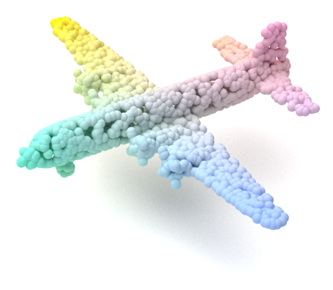

<div style="text-align: center;">
<h1>MitsuCraft</h1>

</div>


<div style="display: flex; justify-content: space-between; align-items: center; text-align: center;">
    
    
</div>

## Introduction

This repository is for the MitsuCraft project, which is a 3D rendering engine that is based on the Mitsuba renderer. 
The goal of this project is to create a 3D rendering engine that is easy to use and can be used for various applications.
The features of the MitsuCraft are as follows:
- **Batch processing**: Process multiple tasks at once, supporting regex searching for input files.
- **Highly Customizable**: The scenes is highly customizable with python dict for both rendering and transformation.
- **Intermediate file reusing**: The intermediate files are saved and can be reused for future rendering tasks with edited render configuration.

## Code structure
The directory structure of the project is as follows:
```
MitsuCraft
├── configs                  <- Configuration files for the rendering engine
│   ├── _base_                    <- Base configuration files
│   └── default                   <- Personalized configuration files
├── figs                     <- Images for the README file
├── input                    <- Directory for input files
│   └── examples                  <- Example input files
├── utils                    <- Utility functions
├── .gitignore               <- Git ignore file
├── main.py                  <- Main file
├── runner.py                <- Runner class for the task processing
├── mitsuba_plugin.py        <- Mitsuba plugin, refer to https://mitsuba.readthedocs.io/en/latest/src/plugin_reference.html
├── mitsuba_util.py          <- Utility class for the Mitsuba renderer
├── transform.py             <- Transformation class
├── requirements.txt         <- Required packages
└── README.md
```

## Quick Start
### Environment setup
We tested the code with Python 3.7.
To install the required packages, run the following command:
```bash
pip install -r requirements.txt
```

### Usage
To render the given example file, run the following command:
```bash
python main.py --config-file config/default/default.py --file examples/plane.ply
```
To render multiple files, run the following command:
```bash
python main.py --config-file config/default/default.py examples/plane.ply examples/office.ply
```
To render multiple files with regex, run the following command:
```bash
python main.py --config-file config/default/default.py --regex .*.ply --options work_dir=input/examples
```
The output files will be saved in the `output/default` directory.
The rendered images will be saved in the `output/default/image` directory.
The intermediate files will be saved in the `output/default/convert` directory.
To reuse the intermediate files, run the following command:
```bash
python main.py --config-file config/default/default.py --file examples/plane.ply --options processed_dir=output/default
```

### Customization
The rendering configuration can be customized by editing the configuration files in the `config/default` directory.
Some of the parameters that can be customized with `--options` in the command line.
For example, to change the resolution of the rendered image, run the following command:
```bash
python main.py --config-file config/default/default.py --file examples/plane.ply --options resolution=[960,540]
```
To change the emitter intensity, run the following command:
```bash
python main.py --config-file config/default/default.py --file examples/plane.ply --options emitter_intensity=[1,1,1]
# or
python main.py --config-file config/default/default.py --file examples/plane.ply --options base_scene.emitter.value=[1,1,1]
```
The detailed explanation of the parameters can be found in the `config/default/default.py` file.

####  Scene and transformation
We defined an example scene and transformation with python dict for rendering in the `config/default/default.py` file, i.e., the `base_scene` and 'pre_transform' variables.
The `base_scene` contains the mitsuba plugins in `mitsuba_plugin.py`, which describes the scene for rendering.
The `pre_transform` contains the transformations in `transfom.py`, which are applied on the raw input data.
Both the `base_scene` and `pre_transform` are built in the initialization of the `Runner` class in `runner.py` file.

#### For specified scene
The parameters for the specified scene can be customized by editing the configuration files in the `config/default` directory.
By default, only the modified parameters need to be given.
Note that, the transformation for the specified scene are **Not** applied when using the intermediate files.

## Acknowledgement
```bibtex
@software{Mitsuba3,
    title = {Mitsuba 3 renderer},
    author = {Wenzel Jakob and Sébastien Speierer and Nicolas Roussel and Merlin Nimier-David and Delio Vicini and Tizian Zeltner and Baptiste Nicolet and Miguel Crespo and Vincent Leroy and Ziyi Zhang},
    note = {https://mitsuba-renderer.org},
    version = {3.1.1},
    year = 2022
}
@misc{mmcv,
    title={{MMCV: OpenMMLab} Computer Vision Foundation},
    author={MMCV Contributors},
    howpublished = {\url{https://github.com/open-mmlab/mmcv}},
    year={2018}
}
```

## TODO
The MitsuCraft project is currently in the early stages of development, and we are looking for contributors to help us improve the project.
- [ ] Support mesh rendering